### 目录
>1.框架介绍

>2.编程模型对比

>3.任务调度原理

>4.时间机制介绍

>5.Kafka动态分区的感知

>6.容错及处理语义

>7.Back pressure

### 1. 编程模型对比

#### 1.1 运行角色
Spark Streaming运行时的角色(standalone模式)主要有：
Master:主要负责整体集群资源的管理和应用程序调度。
Worker:负责单个节点的资源管理，driver和executor的启动等。
Driver:用户入口程序执行的地方，也即是SparkContext执行的地方。主要是DGA生成，stage划分，task生成及调度。
Executor:负责执行task，反馈执行状态和执行结果。

Flink运行时的角色(standalone模式)主要有:
Jobmanager: 协调分布式执行。他们调度任务，协调checkpoints，协调故障恢复等。至少有一个JobManager。高可用情况下可以启动多个JobManager，其中一个选举为leader，其余为standby。
Taskmanager: 负责执行具体的tasks。缓存，交换数据流。至少有一个TaskManager。
Slot: 每个task slot代表TaskManager的一个固定部分资源。Slot的个数代表着taskmanager可以并行执行的task数。
#### 1.2 生态
Spark Streaming生态

Flink生态


#### 1.3 运行模型
Spark Streaming微批处理，运行的时候需要指定批处理的时间，每次运行job的时候处理一个批次的数据。类似下图：


Flink是基于事件驱动的。事件可以理解为消息。事件驱动的应用程序是一种状态应用程序，它会从一个或者多个流中注入事件，通过触发计算，更新状态，或者外部动作对注入的事件作出反应。
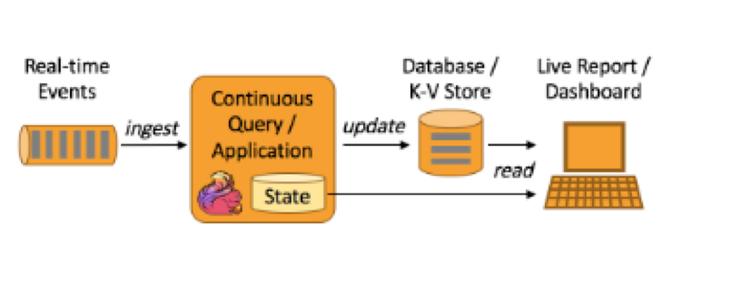

### 2. 编程模型对比
编程模型对比，主要是对比flink和Spark Streaming两者在代码编写上的区别。
#### 2.1 Spark Streaming
Spark Streaming与kafka的结合主要是两种模型：

 * 基于receiver
 
 * 基于direct API

两种模型编程机构差不多，只是api和内部数据获取这块有些区别，新版本的已经取消掉了基于receiver这周模式.我们采用企业中最常用的基于direct API这这种Spark Streaming与kafka的结合方式。
```scala
    val Array(brokers, topics) = args


//    创建一个批处理时间是2s的context
    
    val sparkConf = new SparkConf().setAppName("DirectKafkaWordCount")
    
    val ssc = new StreamingContext(sparkConf, Seconds(2))


    
    //    使用broker和topic创建DirectStream
    
    val topicsSet = topics.split(",").toSet
    
    val kafkaParams = Map[String, String]("metadata.broker.list" -> brokers)
    
    val messages = KafkaUtils.createDirectStream[String, String](
 ssc,
 LocationStrategies.PreferConsistent,

    ConsumerStrategies.Subscribe[String, String](topicsSet, kafkaParams))


  
      // Get the lines, split them into words, count the words and print
    
    val lines = messages.map(_.value)
    
    val words = lines.flatMap(_.split(" "))
    
    val wordCounts = words.map(x => (x, 1L)).reduceByKey(_ + _)
   
     wordCounts.print()


     //    启动流
    
    ssc.start()
    
    ssc.awaitTermination()

```
上面的代码我们可以get到一下几点：
* 设置批处理时间
* 创建数据流
* 编写transform
* 编写action
* 启动执行

接下来，我们可以看看flink与kafka结合时如何编写代码的。Flink与kafka结合要说是事件驱动，那么可能大家会有疑问，因为消费kafka的数据调用poll的时候是批量获取数据的(可以设置批处理大小和超时时间)，这就不能叫做事件触发了。实际上，flink内部对poll出来的数据进行了整理，然后逐条emit，形成了事件触发的机制，这点我们就不在这里细谈了。
```scala
        StreamExecutionEnvironment env = StreamExecutionEnvironment.getExecutionEnvironment();
		env.getConfig().disableSysoutLogging();
		env.getConfig().setRestartStrategy(RestartStrategies.fixedDelayRestart(4, 10000));
		env.enableCheckpointing(5000); // create a checkpoint every 5 seconds
		env.getConfig().setGlobalJobParameters(parameterTool); // make parameters available in the web interface
		env.setStreamTimeCharacteristic(TimeCharacteristic.EventTime);

//		ExecutionConfig.GlobalJobParameters
		env.getConfig().setGlobalJobParameters(null);
		DataStream<KafkaEvent> input = env
				.addSource(
					new FlinkKafkaConsumer010<>(
						parameterTool.getRequired("input-topic"),
						new KafkaEventSchema(),
						parameterTool.getProperties())
					.assignTimestampsAndWatermarks(new CustomWatermarkExtractor())).setParallelism(1).rebalance()
				.keyBy("word")
				.map(new RollingAdditionMapper()).setParallelism(0);

		input.addSink(
				new FlinkKafkaProducer010<>(
						parameterTool.getRequired("output-topic"),
						new KafkaEventSchema(),
						parameterTool.getProperties()));

		env.execute("Kafka 0.10 Example");
```
Flink与kafka结合的代码，我们可以get到如下几条：
* 注册数据source
* 编写运行逻辑
* 注册数据sink
* 调用env.execute
相比于Spark Streaming，这里面少了设置批处理事件。Flink跟Spark Streaming还有一个显著的区别是，flink的所有算子都是lazy形式的，调用env.execute，会构建jobgraph这是在client端做的，然后提交jobgraph到集群运行。而Spark Streaming的操作算子分action和transform，仅有transform是lazy形式的。而且，DGA生成，stage划分，任务调度是在driver端做的，当然在client模式下driver运行于客户端处。

### 3. 任务调度原理
Spark Streaming任务前面也说了是基于微批处理的。实际上每个批次都是一个Spark Core的任务。对于编码好的Spark Core任务在生成到最终执行结束主要包括以下几个部分：
1.	构建DGA图
2.	划分stage
3.	生成taskset
4.	调度task

具体可以参考下图：
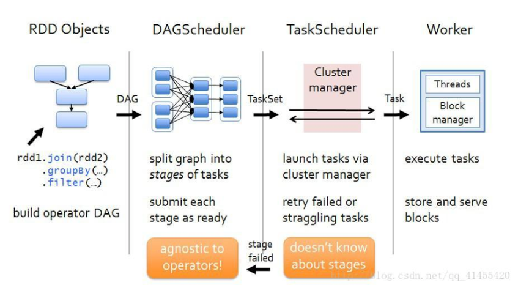
对于job的调度执行有fifo和fair两种模式。Task是根据数据本地性调度执行的。
我们这里假设一个Spark Streaming任务消费的kafkatopic有四个分区；中间有个transform操作，如map；一个reduce操作，后面省去一个foreachpartiton。
那么可以表示出如下图：
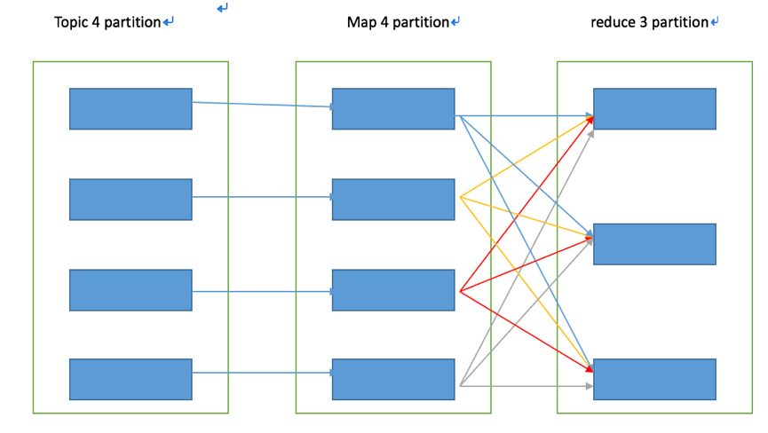
这里假设我们有两个executor，每个executor三个核。那么每个批次，相应的task的运行位置是固定的吗？我们能预测吗？
由于数据本地性和调度不确定性，每个批次对应kafka分区生成的task的运行位置并不是固定的。
	
Flink任务
对于flink的流任务，客户端会先生成StreamGraph，接着生成JobGraph，将jobGraph提交给Jobmanager由jobmanager完成jobGraph到ExecutionGraph的转变，然后由jobManager调度执行。
由一个data source、一个MapFunction和一个ReduceFunction组成的程序，data source和MapFunction的并发度都为4，而ReduceFunction的并发度为3。一个数据流由Source-Map-Reduce的顺序组成，在具有2个TaskManager，每个TaskManager都有3个Task Slot的集群上运行，则程序执行情况如图所述。
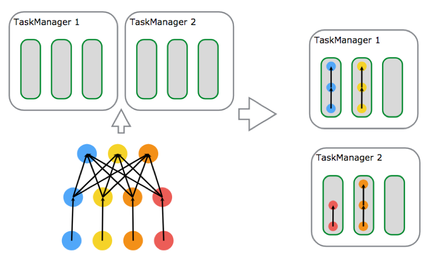

从上图，可以看出，flink的拓扑生成提交执行之后，除非故障，拓扑部件执行位置不变，并行度由每一个算子并行度决定。类似于storm。而spark Streaming是每个批次都会根据数据本地性和资源情况进行调度，无固定的执行拓扑结构。
收据的传输处理，flink是数据在拓扑结构里流动执行，而Spark Streaming则是对数据缓存批次并行处理。

### 4. 时间机制对比
#### 4.1 流处理的时间
流处理程序在时间概念上总共有三个时间层面：
1. 处理时间
处理时间是指每台机器处理的系统时间。当流程序采用处理时间时将使用运行各个运算符实例的机器时间。处理时间是最简单的时间概念，不需要流和机器之间的协调。它能提供最好的性能和最低延迟。然而在分布式和异步环境中，处理时间不能提供消息事件的时序性保证，因为它收到消息传输延迟，消息在算子之间流动的速度等方面制约。
2. 事件时间
事件时间是指事件在其设备上发生的时间。这个时间在事件进入flink之前已经嵌入事件，然后flink可以提取该时间。基于事件时间进行处理的流程序可以保证事件在处理的时候的顺序性，但是基于事件时间的应用程序必须要结合watermark机制。基于事件时间的处理往往有一定的滞后性，因为它需要等待后续事件和无序事件，所以对于时间敏感的应用使用的时候也有引起注意。
3. 注入时间
注入时间是事件注入到flink的时间。事件在source算子处获取source的当前时间作为事件注入时间，后续的基于时间的处理算子会使用该时间处理数据。
相比于事件时间，注入时间不能够处理无序事件或者滞后事件，但是应用程序无序指定如何生成watermark。
在内部，注入时间程序的处理和事件时间类似，但是事件戳分配和watermark生成都是自动的。
下面这张图可以清晰的看出三种时间的：
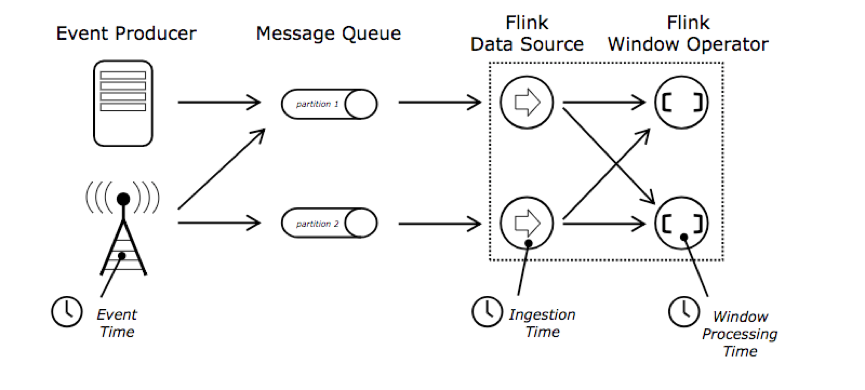

#### 4.2 Spark
Spark Streaming只支持处理时间。
Structured streaming 支持处理时间和事件时间，同时支持watermark机制处理滞后数据。
#### 4.3  Flink
flink支持三种时间：事件时间，注入时间，处理时间；同时支持watermark机制处理滞后数据

### 5. kafka动态分区检测
#### 5.1 Spark Streaming
对于有实时处理的企业，假如业务增长比较好，数据量也会增长，会导致原有的kafka分区不满足数据写入所需的并发度，而需要扩展kafka的分区或者增加kafka的topic，这就要求我们后面的实时处理程序，如SparkStreaming，flink能检测到kafka新增的topic或者分区，消费新增分区的数据。下面我们就结合源码分析一下，Spark Streaming和flink在kafka新增topic或者partition时候能否动态发现，并消费处理新增分区的数据。
Spark Streaming与kafka结合有两个区别比较大的版本。可以先看一下，官网给出的对比数据。


里面已经确认的是spark Streaming与kafka 0.8版本结合不支持动态分区检测，与0.10版本结合支持。接下来去源码分析一下。

1. Spark Streaming与kafka 0.8版本结合

我们这里的源码分析就直奔主题，只针对分区检测这块的代码。
入口是DirectKafkaInputDStream的compute
```scala
override def compute(validTime: Time): Option[KafkaRDD[K, V, U, T, R]] = {
//    改行代码会计算这个job，要消费的每个kafka分区的最大偏移
    val untilOffsets = clamp(latestLeaderOffsets(maxRetries))
//    构建KafkaRDD，用指定的分区数和要消费的offset范围
    val rdd = KafkaRDD[K, V, U, T, R](
      context.sparkContext, kafkaParams, currentOffsets, untilOffsets, messageHandler)

    // Report the record number and metadata of this batch interval to InputInfoTracker.
    val offsetRanges = currentOffsets.map { case (tp, fo) =>
      val uo = untilOffsets(tp)
      OffsetRange(tp.topic, tp.partition, fo, uo.offset)
    }
    val description = offsetRanges.filter { offsetRange =>
      // Don't display empty ranges.
      offsetRange.fromOffset != offsetRange.untilOffset
    }.map { offsetRange =>
      s"topic: ${offsetRange.topic}\tpartition: ${offsetRange.partition}\t" +
        s"offsets: ${offsetRange.fromOffset} to ${offsetRange.untilOffset}"
    }.mkString("\n")
    // Copy offsetRanges to immutable.List to prevent from being modified by the user
    val metadata = Map(
      "offsets" -> offsetRanges.toList,
      StreamInputInfo.METADATA_KEY_DESCRIPTION -> description)
    val inputInfo = StreamInputInfo(id, rdd.count, metadata)
    ssc.scheduler.inputInfoTracker.reportInfo(validTime, inputInfo)

    currentOffsets = untilOffsets.map(kv => kv._1 -> kv._2.offset)
    Some(rdd)
  }
```
第一行就是计算得到该批次生成KafkaRDD每个分区要消费的最大offset。
进去latestLeaderOffsets(maxRetries)
```scala
@tailrec
  protected final def latestLeaderOffsets(retries: Int): Map[TopicAndPartition, LeaderOffset] = {
//    可以看到的是用来指定获取最大偏移分区的列表还是只有currentOffsets，没有发现关于新增的分区的内容。
    val o = kc.getLatestLeaderOffsets(currentOffsets.keySet)
    // Either.fold would confuse @tailrec, do it manually
    if (o.isLeft) {
      val err = o.left.get.toString
      if (retries <= 0) {
        throw new SparkException(err)
      } else {
        logError(err)
        Thread.sleep(kc.config.refreshLeaderBackoffMs)
        latestLeaderOffsets(retries - 1)
      }
    } else {
      o.right.get
    }
  }
```

其中，  protected var currentOffsets = fromOffsets，这个仅仅是在构建DirectKafkaInputDStream的时候初始化，compute里面更新
```scala
currentOffsets = untilOffsets.map(kv => kv._1 -> kv._2.offset)
```
中间没有检测kafka新增topic或者分区的代码，所以，可以确认的是Spark Streaming与kafka 0.8的版本结合不支持动态分区检测。

2. Spark Streaming与kafka 0.10版本结合

入口也是DirectKafkaInputDStream的compute方法。这里就不贴compute全部代码了，我们捡主要的部分说话。Compute里第一行也是计算当前job生成kafkardd要消费的每个分区的最大offset
```scala
//    获取当前生成job，要用到的KafkaRDD每个分区最大消费偏移值
    val untilOffsets = clamp(latestOffsets())
```

具体检测kafka新增topic或者分区的代码在latestOffsets()
```scala
 /**
   * Returns the latest (highest) available offsets, taking new partitions into account.
   */
  protected def latestOffsets(): Map[TopicPartition, Long] = {
    val c = consumer
    paranoidPoll(c)
    // 获取所有的分区信息
    val parts = c.assignment().asScala

    // make sure new partitions are reflected in currentOffsets
    // 做差获取新增的分区信息
    val newPartitions = parts.diff(currentOffsets.keySet)
    // position for new partitions determined by auto.offset.reset if no commit
    // 新分区消费位置，没有记录的化是由auto.offset.reset决定
    currentOffsets = currentOffsets ++ newPartitions.map(tp => tp -> c.position(tp)).toMap
    // don't want to consume messages, so pause
    c.pause(newPartitions.asJava)
    // find latest available offsets
    c.seekToEnd(currentOffsets.keySet.asJava)
    parts.map(tp => tp -> c.position(tp)).toMap
  }
```
该方法里面有获取kafka新增分区，并将其更新到currentOffsets的过程。所以可以验证，Spark Streaming与kafka 0.10版本结合支持动态分区检测。

#### 5.2 Flink
入口类是FlinkKafkaConsumerBase。该类是所有flink的kafka消费者的父类。
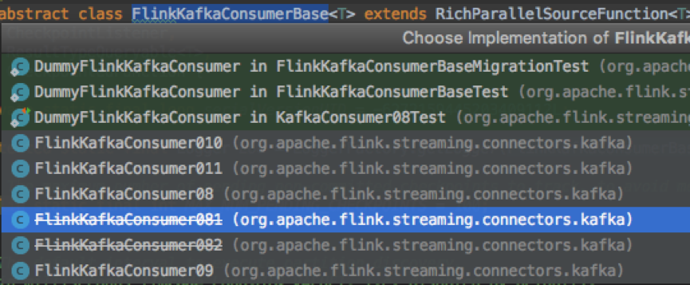
在FlinkKafkaConsumerBase的run方法中，创建了kafkaFetcher实际上就是消费者

```scala
this.kafkaFetcher = createFetcher(
				sourceContext,
				subscribedPartitionsToStartOffsets,
				periodicWatermarkAssigner,
				punctuatedWatermarkAssigner,
				(StreamingRuntimeContext) getRuntimeContext(),
				offsetCommitMode,
				getRuntimeContext().getMetricGroup().addGroup(KAFKA_CONSUMER_METRICS_GROUP),
				useMetrics);
```
接是创建了一个线程，该线程会定期检测kafka新增分区，然后将其添加到kafkaFetcher里。
```scala
if (discoveryIntervalMillis != PARTITION_DISCOVERY_DISABLED) {
			final AtomicReference<Exception> discoveryLoopErrorRef = new AtomicReference<>();
			this.discoveryLoopThread = new Thread(new Runnable() {
				@Override
				public void run() {
					try {
						// --------------------- partition discovery loop ---------------------

						List<KafkaTopicPartition> discoveredPartitions;

						// throughout the loop, we always eagerly check if we are still running before
						// performing the next operation, so that we can escape the loop as soon as possible

						while (running) {
							if (LOG.isDebugEnabled()) {
								LOG.debug("Consumer subtask {} is trying to discover new partitions ...", getRuntimeContext().getIndexOfThisSubtask());
							}

							try {
								discoveredPartitions = partitionDiscoverer.discoverPartitions();
							} catch (AbstractPartitionDiscoverer.WakeupException | AbstractPartitionDiscoverer.ClosedException e) {
								// the partition discoverer may have been closed or woken up before or during the discovery;
								// this would only happen if the consumer was canceled; simply escape the loop
								break;
							}

							// no need to add the discovered partitions if we were closed during the meantime
							if (running && !discoveredPartitions.isEmpty()) {
								kafkaFetcher.addDiscoveredPartitions(discoveredPartitions);
							}

							// do not waste any time sleeping if we're not running anymore
							if (running && discoveryIntervalMillis != 0) {
								try {
									Thread.sleep(discoveryIntervalMillis);
								} catch (InterruptedException iex) {
									// may be interrupted if the consumer was canceled midway; simply escape the loop
									break;
								}
							}
						}
					} catch (Exception e) {
						discoveryLoopErrorRef.set(e);
					} finally {
						// calling cancel will also let the fetcher loop escape
						// (if not running, cancel() was already called)
						if (running) {
							cancel();
						}
					}
				}
			}, "Kafka Partition Discovery for " + getRuntimeContext().getTaskNameWithSubtasks());

			discoveryLoopThread.start();
			kafkaFetcher.runFetchLoop();
```

上面，就是flink动态发现kafka新增分区的过程。不过与Spark无需做任何配置不同的是，flink动态发现kafka新增分区，这个功能需要被使能的。也很简单，需要将flink.partition-discovery.interval-millis该属性设置为大于0即可。

### 6. 容错机制及处理语义
本节内容主要是想对比两者在故障恢复及如何保证恰一次的处理语义。这个时候适合抛出一个问题：实时处理的时候，如何保证数据恰一次处理语义？

#### 6.1 Spark Streaming保证恰一次处理

对于Spark Streaming任务，我们可以设置checkpoint，然后假如发生故障，重启我们可以从上次checkpoint之处恢复，但是这个行为只能导致数据不丢失，可能会重复处理，不能做到恰一次处理语义。

对于Spark Streaming与kafka结合的direct Stream 可以自己维护offset到zookeeper，kafka或者任何其它外部系统，每次提交完结果之后再提交offset，这样故障恢复重启，可以利用上次提交的offset恢复。这样可以保证数据不丢失，但是故障假如发生在提交结果之后，提交offset之前，会导致数据多次处理。这个时候，我们需要保证处理结果多次输出不影响正常的业务。

由此，可以分析，假如要保证数据恰一次处理语义，那么结果输出和offset提交必须在一个事务内完成。在这里有以下两种做法：
1. repartition(1)
Spark Streaming输出的action 变成仅一个partition。这样可以利用事务去做。
```scala
  Dstream.foreachRDD(rdd=>{
    rdd.repartition(1).foreachPartition(partition=>{
    //    开启事务
        partition.foreach(each=>{
//        提交数据
        })
    //  提交事务
    })
  })
```
2. 将结果和offset一起提交。
也就是结果数据包含offset。这样，提交结果和提交offset就是一个操作完成，不会数据丢失，也不会重复处理。故障恢复的时候可以利用上次提交结果带的offset。
Flink与kafka 0.11保证恰一次处理

若要sink支持恰一次语义，必须以事务的方式写数据到Kafka，这样当提交事务时两次checkpoint间的所有写入操作当作为一个事务被提交。这确保了出现故障或崩溃时这些写入操作能够被回滚。

当然了，在一个分布式且含有多个并发执行sink的应用中，仅仅执行单次提交或回滚是不够的，因为所有组件都必须对这些提交或回滚达成共识，这样才能保证得到一个一致性的结果。Flink使用两阶段提交协议以及预提交(pre-commit)阶段来解决这个问题。
本例中的Flink应用包含以下组件，如下图所示：
 1. 一个source，从Kafka中读取数据（即KafkaConsumer）
 2. 一个时间窗口化的聚会操作
 3. 一个sink，将结果写回到Kafka（即KafkaProducer）

思路如下：Flink checkpointing开始时便进入到pre-commit阶段。具体来说，一旦checkpoint开始，Flink的JobManager向输入流中写入一个checkpoint barrier将流中所有消息分割成属于本次checkpoint的消息以及属于下次checkpoint的。barrier也会在操作算子间流转。对于每个operator来说，该barrier会触发operator状态后端为该operator状态打快照。
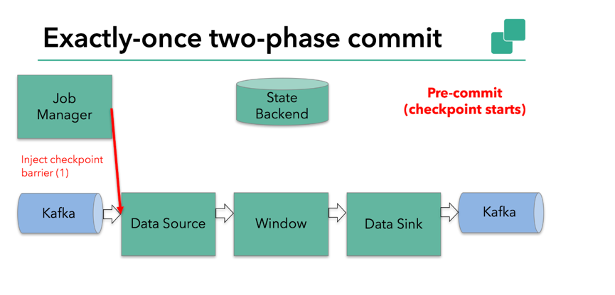
data source保存了Kafka的offset，之后把checkpoint barrier传递到后续的operator。

这种方式仅适用于operator仅有他的内部状态。内部状态是指，Flink state backends保存和管理的内容-举例来说，第二个operator中window聚合算出来的sum。
当一个进程仅有它的内部状态的时候，除了在checkpoint之前将需要将数据更改写入到state backend，不需要在预提交阶段做其他的动作。
在checkpoint成功的时候，Flink会正确的提交这些写入，在checkpoint失败的时候会终止提交。
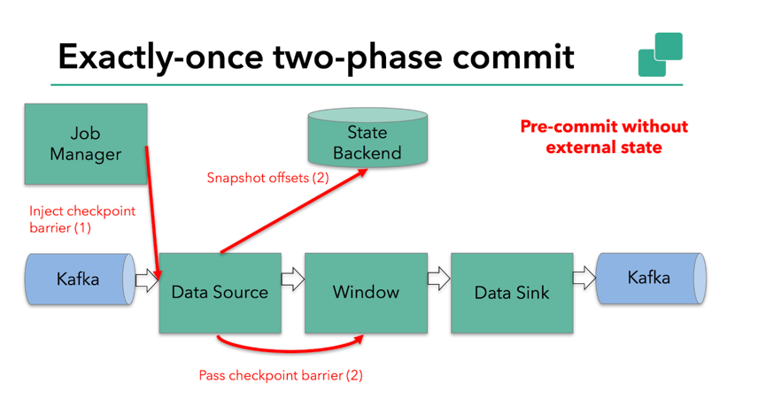
当结合外部系统的时候，外部系统必须要支持可与两阶段提交协议捆绑使用的事务。显然本例中的sink由于引入了kafka sink，因此在预提交阶段data sink必须预提交外部事务。如下图：

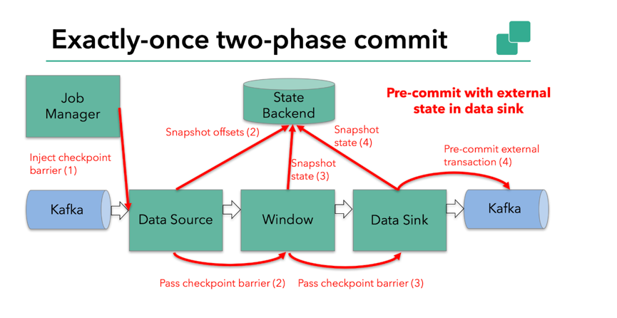
当barrier在所有的算子中传递一遍，并且触发的快照写入完成，预提交阶段完成。所有的触发状态快照都被视为checkpoint的一部分。也可以说checkpoint是整个应用程序的状态快照，包括预提交外部状态。出现故障可以从checkpoint恢复。

下一步就是通知所有的操作算子checkpoint成功。该阶段jobmanager会为每个operator发起checkpoint已完成的回调逻辑。
本例中data source和窗口操作无外部状态，因此该阶段，这两个算子无需执行任何逻辑，但是data sink是有外部状态的，因此，此时我们必须提交外部事务，如下图：

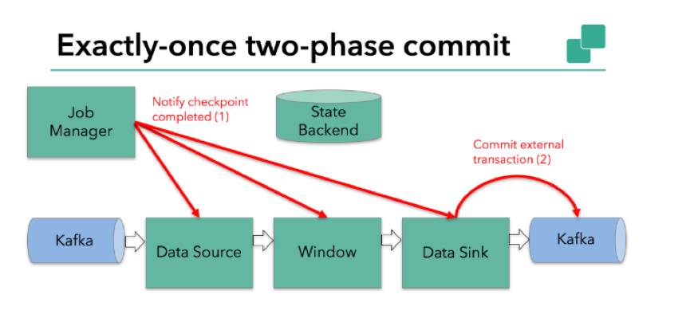

以上就是flink实现恰一次处理的基本逻辑。
### 7. backpressure

backpressure后面一律叫做背压。消费者消费的速度低于生产者生产的速度，为了使应用正常，消费者会反馈给生产者来调节生产者生产的速度，以使得消费者需要多少，生产者生产多少。
#### 7.1 Spark Streaming的背压
Spark Streaming 跟kafka结合使存在背压机制的。目标是这样根据当前job的处理情况，来调节后续批次的获取kafka消息的条数。为了达到这个目的Spark Streaming在原有的架构上加入了一个RateController，利用的算法是PID，需要的反馈数据是任务处理的结束时间，调度时间，处理时间，消息条数，这些数据是通过SparkListener体系获得，然后通过PIDRateEsimator的compute计算得到一个速率，进而可以计算得到一个offset，然后跟你的限速设置最大消费条数做比较得到一个最终要消费的消息条数。
PIDRateEsimator的compute方法如下：
```scala
 def compute(
      time: Long, // in milliseconds
      numElements: Long,
      processingDelay: Long, // in milliseconds
      schedulingDelay: Long // in milliseconds
    ): Option[Double] = {
    logTrace(s"\ntime = $time, # records = $numElements, " +
      s"processing time = $processingDelay, scheduling delay = $schedulingDelay")
    this.synchronized {
      if (time > latestTime && numElements > 0 && processingDelay > 0) {

        val delaySinceUpdate = (time - latestTime).toDouble / 1000

        val processingRate = numElements.toDouble / processingDelay * 1000

        val error = latestRate - processingRate

        val historicalError = schedulingDelay.toDouble * processingRate / batchIntervalMillis

        // in elements/(second ^ 2)
        val dError = (error - latestError) / delaySinceUpdate

        val newRate = (latestRate - proportional * error -
                                    integral * historicalError -
                                    derivative * dError).max(minRate)
        logTrace(s"""
            | latestRate = $latestRate, error = $error
            | latestError = $latestError, historicalError = $historicalError
            | delaySinceUpdate = $delaySinceUpdate, dError = $dError
            """.stripMargin)

        latestTime = time
        if (firstRun) {
          latestRate = processingRate
          latestError = 0D
          firstRun = false
          logTrace("First run, rate estimation skipped")
          None
        } else {
          latestRate = newRate
          latestError = error
          logTrace(s"New rate = $newRate")
          Some(newRate)
        }
      } else {
        logTrace("Rate estimation skipped")
        None
      }
    }
  }
```
#### 7.2 Flink的被压
与Spark Streaming的被压不同的是，Flink被压式jobmanager针对每一个task每50ms触发100次Thread.getStackTrace()调用，求出阻塞的占比。如下图：
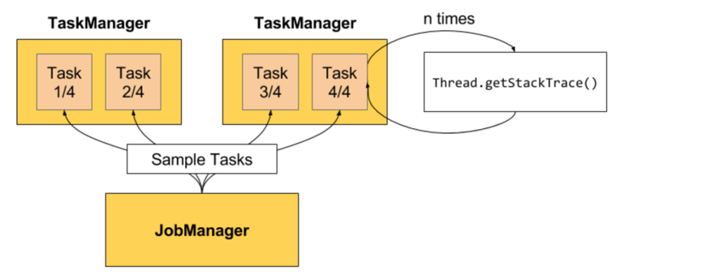

阻塞占比，在web上划分了三个等级。
* OK: 0 <= Ratio <= 0.10

* LOW: 0.10 < Ratio <= 0.5

* HIGH: 0.5 < Ratio <= 1
